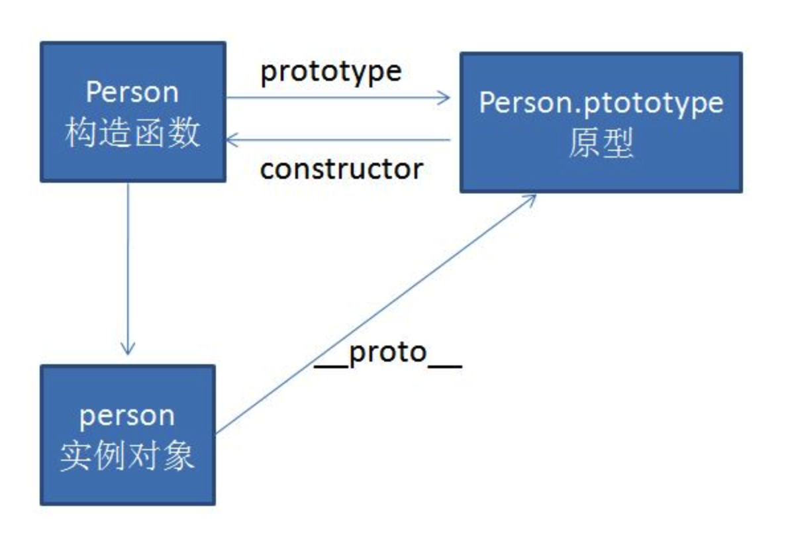

## 二、创建对象

在上一节说到使用构造函数模式创建对象有一个缺点：<font color='red'>每个方法在每个实例上都需要重新创建一遍</font>。然而往往这些方法在实例上是相同的，所以创建两个完成同样任务的 Function 实例完全没有必要，所以我们可以像下面这样**把函数定义在构造函数之外**：

```js
function Person(name, age, job) {
  this.name = name;
  this.age = age;
  this.job = job;
  this.sayName = sayName;
}
function sayName() {
  console.log(this.name);
}
```

上面这种方式虽然可以解决相同类型实例间共享同一函数的问题，但是由于函数定义在**全局作用域**中，所以该函数（sayName）在作用域的角度来看，应该可以被所有的对象调用，但是实际上，在这里，它只是 Person 实例的私有方法，这很容易引起混淆。并且最致命的问题是：<font color='red'>在全局定义的方法会污染全局作用域</font>（当多个构造函数想使用名字相同、内容不同的函数时，是做不到的）。**这个问题可以通过原型模式来解决**

### 2.3 原型模式

js 中实现继承的概念和 java 中的类不同，他是通过原型链来实现的，以一张图以蔽之：



#### 2.3.1 原型的理解

我们创建的每一个函数都会有一个 prototype（原型）属性，该属性指向的是一个对象，该对象就是函数的原型对象。使用原型对象的好处在于可以**让所有对象实例共享它所包含的属性和方法**。

```js
function Person() {}

Person.prototype.name = "xiaokang";
Person.prototype.age = "26";
Person.prototype.job = "programmer";
Person.prototype.say = function () {
  console.log("more better!");
};
```

创建两个 Person 实例，查看他们共享 say 方法：

```js
let p1 = new Person();
let p2 = new Person();
console.log(p1.say === p2.say); // true
```

不光是方法，包括属性（name, age, job）都被实例所共享。如果我们想在不同实例上使用相同的属性具有代表自己的值，则可以直接在实例中创建同名的属性，**该属性会屏蔽原型中的那个属性**，<font color='red'>这个就是 js 中重要的原型链作用域。</font>

```js
p1.name = "xiaoming";
console.log(p1.name); // xiaoming --- 来自实例
console.log(p2.name); // xiaokang --- 来自原型链
```

在实例上设置了与原型相同属性，只会“屏蔽”，不会修改原型的属性，可以使用 delete 操作符来删除实例上的实例属性，来“解除屏蔽”：

```js
delete p1.name;
console.log(p1.name); // xiaokang --- 删除实例上的name属性后，解除屏蔽，返回原型上name属性的值
```

原型的检测使用 hasOwnProperty()方法：

```js
p1.hasOwnProperty("name"); // false
p1.name = "xiaoli";
p1.hasOwnProperty("name"); // true
```

#### 2.3.2 对象属性

对象的属性有一个特性叫做**可枚举**---enumerate，这个在我们手动创建实例属性的时候默认为 true，只有在通过 Object.defineProperty（或者复数形式）创建时，才可以显式的指定。
&emsp;&emsp;在对象的属性遍历上，我们有三种方式：

1. Object.keys
   遍历对象本身的所有可枚举属性
2. Object.getOwnPropertyNames
   遍历对象本身的所有可枚举与不可枚举属性
3. for...in
   遍历对象本身及原型链上所有可枚举属性

在上面我们的原型模式中，每声明一个属性或方法都需要写一遍 Person.prototype，所以更简便的方法通常如下：

```js
function Person() {}

Person.prototype = {
  name: "xiaokang",
  age: 26,
  job: "programmer",
  say: function () {
    console.log("be better!");
  },
};
```

上面这种写法简便了操作，但是有一个严重的问题是<font color='red'>因为 Person 的原型对象被重新赋值（本质上是完全重写了默认的 prototype 对象）</font>，所以原有的 constructor 属性就没了。

为了解决这个问题，可以像下面这个这样做：

```js
function Person() {}

Person.prototype = {
  constructor: Person,
  name: "xiaokang",
  age: 26,
  job: "programmer",
  say: function () {
    console.log("be better!");
  },
};
```

但是这里注意！上面我们说到直接给对象设置的属性，属性的[[Enumerable]]会为 true。而很明显，函数声明后，默认的 constructor 是不可枚举的，所以这里可以使用 Object.defineProperty 来解决这个问题：

```js
function Person() {}

Person.prototype = {
  name: "xiaokang",
  age: 26,
  job: "programmer",
  say: function () {
    console.log("be better!");
  },
};
Object.defineProperty(Person.prototype, "constructor", {
  enumerable: false,
  value: Person,
});
```

思考：**上面这种重写原型的模式能用么？**
答案：**根本不行！**

原因：

```js
function Person() {}

let p = new Person();

Person.prototype = {
  constructor: Person,
  name: "xiaokang",
  age: 26,
  job: "programmer",
  say: function () {
    console.log("be better!");
  },
};
p.say(); // error
```

这种重写了原型的方式会导致原型链“断链”，即 say 方法声明在了“新的原型”上，而先前使用 Person 实例化出来的 p 对象，它的**proto**已经绑定了“旧的原型”，而使用 p 调用 say 方法，只会从自身开始沿着“旧的原型”向上找，显然找不到。

#### 2.3.3 原型模式的问题及原生对象的启发

1. 原型模式的问题

原型模式的最大的问题在于：<font color='red'>当原型上声明引用类型的属性时，会导致不同实例无法拥有独有属性值(他们会共用同一个值)</font>

```js
function Person() {}

Person.prototype = {
  constructor: Person,
  name: "xiaokang",
  age: 26,
  job: ["programmer", "worker"],
  say: function () {
    console.log("be better!");
  },
};

let a1 = new Person();
let a2 = new Person();
a1.job.push("doctor");

console.log(a1.job); // ['programmer', 'worker', 'doctor']
console.log(a2.job); // ['programmer', 'worker', 'doctor']
console.log(a1.job === a2.job); // true --- 指针相同
```

**实例一般都是要有自己的属性，所以很少有人单独使用原型模式来创建对象**

2. 原生对象的启发

我们看到像 Array、Object、String 等原生的构造函数，他们的方法都是定义在其原型上，而在原生构造函数实例化的对象上，声明实例独有的属性，如：

```js
console.log(typeof Array.prototype.sort); // function
let arr = new Array();
arr[0] = 1; // 属性0，值为1
```

所以更一般的，我们**组合使用构造函数模式和原型模式**创建对象，这也是<font color='blue'>ECMAScript 目前使用最广泛，认同度最高的创建自定义类型的方法！！！</font>

### 2.4 组合使用构造函数模式和原型模式

```js
function Person(name, age) {
  this.name = name;
  this.age = age;
  this.job = ["a", "b"];
}

Person.prototype = {
  constructor: Person,
  sayName: function () {
    console.log(this.name);
  },
};
```

属性定义在构造函数中，方法定义在原型上。在不要求 constructor 字段可枚举性时，可以直接在原型内部显式定义。
